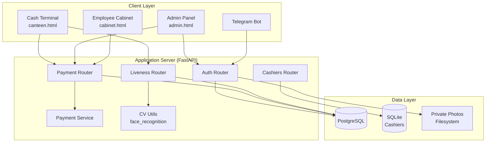
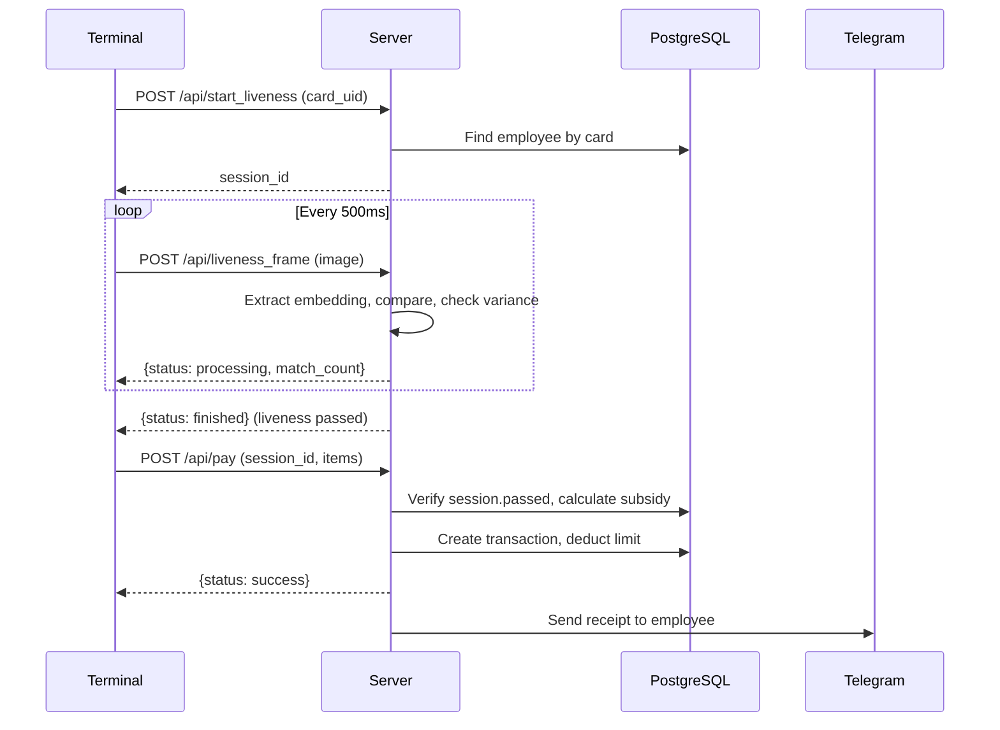

# Architecture

## System Overview

Cafeteria is a corporate cafeteria management system that automates meal payments using RFID cards and biometric face verification.

## Components

### HTTP Layer (Routers)

| Router | Responsibility |
|--------|---------------|
| `auth.py` | Admin login (JWT), employee CRUD, roles, schedule, biometric enrollment |
| `payment.py` | Payment processing, cash desks, products/categories, statistics |
| `liveness.py` | Face verification sessions, anti-spoofing algorithm |
| `bot.py` | Telegram bot (balance queries, notifications) |
| `cashiers.py` | Cashier management (separate SQLite store) |

### Business Logic Layer

- `services/payment_service.py` — order total calculation, subsidy logic
- `cv_utils.py` — face embedding extraction, comparison with configurable tolerance
- `security.py` — JWT tokens, bcrypt password hashing

### Data Layer

- **PostgreSQL** — primary database (employees, transactions, cards, schedules)
- **SQLite** — lightweight cashier registry (no foreign-key coupling to main DB)
- **Filesystem** — private photo storage (`/app/private_photos/`)

## Payment Flow

## Deployment

- **Docker Compose** with 3 services: PostgreSQL, FastAPI (Uvicorn), Caddy (HTTPS)
- Caddy provides automatic TLS certificate management
- Volumes for persistent data (PostgreSQL, Caddy certs)
