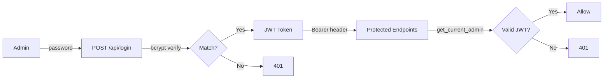

# Security Model

## Threat Model

### Assets Protected
1. **Employee financial limits** — monthly budget that must not be spent without authorization
2. **Biometric data** — face embeddings and photos (PII)
3. **Admin access** — system configuration and employee management
4. **Transaction integrity** — payments must be accurate and non-repudiable

### Threat Actors

| Actor | Motivation | Capability |
|-------|-----------|------------|
| Unauthorized employee | Free meals, spend someone else's limit | Physical access to terminal |
| External attacker | Data theft, system disruption | Network access |
| Spoofing attacker | Bypass face verification with a photo | Printed photo or phone screen |

### Attack Vectors & Mitigations

#### 1. Photo Spoofing (Critical)
**Attack:** Present a printed photo or phone screen to the camera.
**Mitigation:** Variance-based liveness detection.
- Live faces produce micro-movements → embedding distances vary (range > 0.02)
- Static images produce identical embeddings (range < 0.01)
- Requires 4+ consecutive frames with face match AND sufficient variance
- See [LIVENESS_ALGORITHM.md](./LIVENESS_ALGORITHM.md) for technical details

#### 2. Stolen RFID Card
**Attack:** Use someone else's card to pay.
**Mitigation:** Two-factor: card + face verification.
- Card identifies the employee, face confirms identity
- If liveness fails, cashier must manually confirm (logged + alerted)

#### 3. Payment Without Verification
**Attack:** Call `/api/pay` directly without passing liveness.
**Mitigation:** Server-side `session.passed` check.
- The `passed` flag is set ONLY by the server after successful liveness
- Client cannot forge it — it's stored in the database
- Manual payments (bypassing liveness) trigger an alert with photos to admin Telegram

#### 4. Admin Panel Brute Force
**Attack:** Guess admin password via repeated login attempts.
**Mitigation:**
- Passwords hashed with bcrypt (intentionally slow, ~100ms/attempt)
- JWT tokens with 24h expiration
- CORS policy restricts origins

#### 5. Photo Data Exfiltration
**Attack:** Access employee biometric photos without authorization.
**Mitigation:**
- Photos stored outside public `/static/` directory
- Served only via `/api/photos/` with JWT token or valid liveness session
- Session-based access verifies card_uid match (terminal can only see its own session's photo)

## Authentication Architecture

## Data Protection

| Data | Storage | Access Control |
|------|---------|---------------|
| Face embeddings | PostgreSQL (JSON) | Admin-only endpoints |
| Employee photos | Filesystem (private) | JWT or session-verified |
| Passwords | bcrypt hashes | Never stored in plaintext |
| JWT secret | Environment variable | Not in codebase |
| Transactions | PostgreSQL | Admin panel + employee's own via card |
